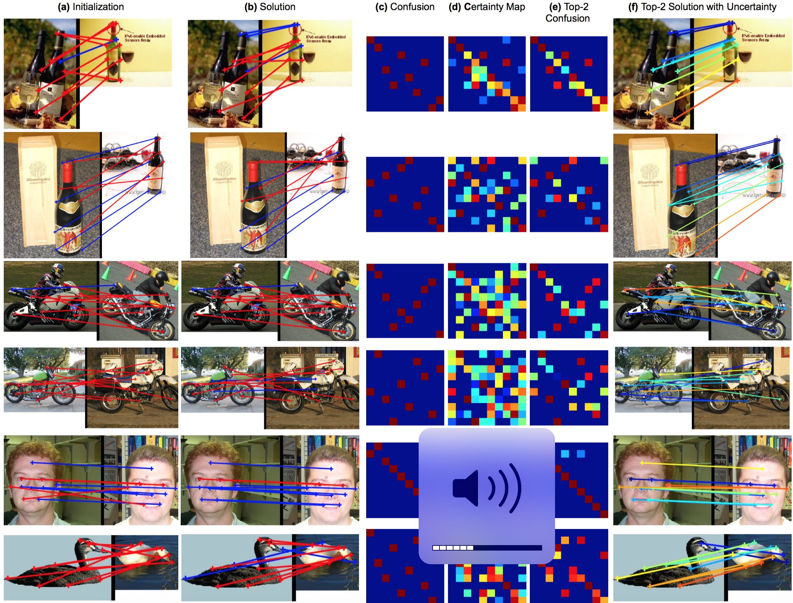

# Probabilistic Permutation Synchronization using the Riemannian Structure of the Birkhoff Polytope

[CVPR 2019](http://cvpr2019.thecvf.com/)

[Tolga Birdal](http://tbirdal.me/) & [Umut Şimşekli](https://perso.telecom-paristech.fr/simsekli/)

[Stanford University](http://www.stanford.edu) & [Télécom ParisTech](http://www.telecom-paristech.fr/)

 

## Abstract
We present an entirely new geometric and probabilistic approach to synchronization of correspondences across multiple sets of objects or images. In particular, we present two algorithms: (1) Birkhoff-Riemannian L-BFGS for optimizing the relaxed version of the combinatorially intractable cycle consistency loss in a principled manner, (2) Birkhoff-Riemannian Langevin Monte Carlo for generating samples on the Birkhoff Polytope and estimating the confidence of the found solutions. To this end, we first introduce the very recently developed Riemannian geometry of the Birkhoff Polytope. Next, we introduce a new probabilistic synchronization model in the form of a Markov Random Field (MRF). Finally, based on the first order retraction operators, we formulate our problem as simulating a stochastic differential equation and devise new integrators. We show on both synthetic and real datasets that we achieve high quality multi-graph matching results with faster convergence and reliable confidence/uncertainty estimates.

## Downloads
[Paper](https://arxiv.org/abs/1904.05814) | [BibTex](doc/BirdalSimsekli2019.bib)

## Video

